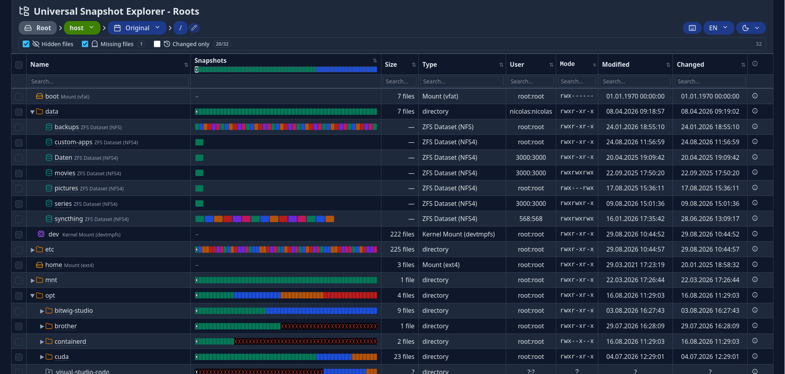
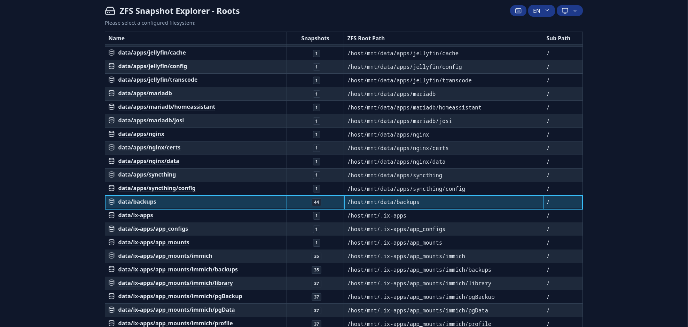
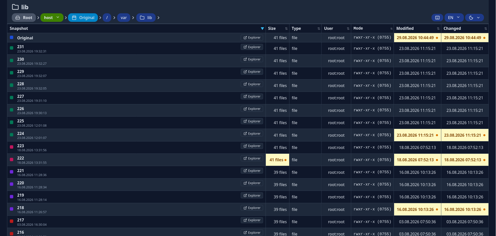

# Universal Snapshot Explorer (USE) 📸

[](https://github.com/NicolasGoeddel/zfs-snapshot-explorer/actions/workflows/ci.yml)
[](#testing--code-quality)
[](https://github.com/detachhead/basedpyright)
[](https://github.com/astral-sh/ruff)
[](https://www.python.org/)
[](https://github.com/NicolasGoeddel/zfs-snapshot-explorer/pkgs/container/universal-snapshot-explorer)
[](https://github.com/NicolasGoeddel/zfs-snapshot-explorer/blob/main/LICENSE)

A high-performance, lightweight, read-only web explorer and audit tool for **OpenZFS, Btrfs & POSIX filesystem snapshots**.

Instead of browsing snapshots one by one or mounting snapshot directories manually over SSH, **Universal Snapshot Explorer** visualizes the complete version history of all files and folders across all available snapshots simultaneously.

---

## 📸 Screenshots

### Explorer View (Multi-Snapshot Timeline)


### Roots Dashboard (Dataset Overview)


### File Details & Version History


---

## ✨ Key Features

* **📊 Multi-Snapshot Timeline Bar:** Each file and folder features an interactive, color-coded timeline bar indicating modifications, creations, deletions, and static periods across all snapshots at a single glance.
* **🗂️ Pluggable Multi-Filesystem Architecture:** Native support for **OpenZFS** datasets (`.zfs/snapshot`) and **Btrfs** subvolumes (including **Snapper** metadata layouts).
* **🌐 Boundary & Mount Discovery:** Automatically detects nested mount points and sub-datasets via `/proc/mounts`, rendering dedicated per-dataset snapshot timelines in table rows and breadcrumbs.
* **🤖 ZFS CLI Integration & Auto-Discovery:** Seamlessly discovers all active datasets across your ZFS pools with `/dev/zfs` passthrough and retrieves exact snapshot creation timestamps directly from ZFS metadata.
* **📦 Checkbox Multi-Selection & Streaming ZIP Download:** Select multiple files or folders across any snapshot and download them instantly as an on-the-fly streaming ZIP archive without creating temporary files on disk.
* **🔍 Instant Audit Filters:**
  * **"Changed only"** (`history` icon): Instantly filter out static files to spot what was modified, added, or deleted between snapshots.
  * **"Missing files"** (`ghost` icon): Toggle visibility of files that do not exist in the current snapshot.
  * **"Hidden files"** (`eye-off` icon): Toggle visibility of dotfiles (`.*`).
* **⌨️ Full Keyboard Navigation:**
  * `↑` / `↓`: Navigate through rows.
  * `→` / `←`: Expand/collapse folders or navigate to parent directories.
  * `Enter`: Open selected folder or download file.
  * `i`: Open deep version details view.
  * `Ctrl + L` / `Cmd + L`: Jump to breadcrumb path bar with live typeahead.
  * `h` / `?`: Open keyboard shortcuts cheat sheet.
* **🧭 Clean URL Structure (`/-/` Delimiter):** Uses the proven GitLab/GitHub delimiter pattern (`/list/pool/dataset/-/sub/folder`) for unambiguous navigation in deeply nested dataset pools.
* **📋 Deep File Details & Change History:** Compare file sizes, MIME types, POSIX permissions, ownership (UID/GID resolved via host `/etc/passwd`), and timestamps across all snapshot versions.
* **🔒 Safe & Read-Only:** Operates completely read-only (`:ro`). Zero database, zero storage overhead, and zero risk of accidental data modification.
* **🌓 Modern Dark & Light Theming:** Seamless system theme detection (`prefers-color-scheme`) with an instant toggle and Lucide vector icons.
* **🌍 Multi-Language Support (i18n):** Native support for English and German with automatic browser language detection.

---

## 🎯 Use Cases

1. **Self-Service File Recovery for Teams & Homelabs:** Let users easily locate and download previous versions of their documents without needing SSH access or bothering system administrators.
2. **Forensic Audit & Incident Response:** Instantly pinpoint the exact snapshot where a ransomware attack, faulty migration script, or unintended deletion took place.
3. **Version History for Large Assets (Video, 3D, Audio, CAD):** A "Git-like" visual history browser for large binary assets where traditional version control systems struggle.

---

## 🚀 Quick Start with Docker & TrueNAS Scale

### 1. `docker-compose.yaml`

Run the container with `/dev/zfs` device passthrough and mount the host filesystem root to `/host` with `rslave` propagation for dynamic ZFS snapshot automounts:

```yaml
services:
  universal-snapshot-explorer:
    image: ghcr.io/nicolasgoeddel/universal-snapshot-explorer:latest
    container_name: universal-snapshot-explorer
    restart: unless-stopped
    ports:
      - "8090:8080"

    # Privileged flags (privileged, security_opt, cap_add, devices) are ONLY required if you
    # want to query ZFS metadata via ZFS CLI commands (ZfsCliSnapshotProvider).
    # You can completely omit these if you run in unprivileged User-Space fallback mode
    # (FilesystemSnapshotProvider), which discovers snapshots by scanning .zfs/snapshot dirs.
    privileged: true
    security_opt:
      - apparmor:unconfined
    cap_add:
      - SYS_ADMIN
    devices:
      - /dev/zfs:/dev/zfs

    volumes:
      # Read-only access to host root. 'rslave' propagation is needed to dynamically propagate
      # ZFS auto-mounted snapshots from host to container. Use simple ':ro' for static mounts.
      - /:/host:ro,rslave
      # Application configuration file
      - ./config.yaml:/app/config.yaml:ro

    environment:
      - PYTHONUNBUFFERED=1
```

### 2. `config.yaml`

```yaml
# Global OpenZFS Auto-Discovery Configuration
zfs:
  # Automatically discover all mounted ZFS datasets on the host (scanning for .zfs/snapshot directories)
  auto_discover: true

  # Prefix where the host filesystem root is mounted in the container
  mount_prefix: "/host"

  # Glob patterns for datasets to ignore during auto-discovery
  exclude_datasets:
    - "*/.system*"
    - "*/ix-applications*"
    - "*/docker*"
    - "*/custom-apps*"

  # Default host user/group resolution files to map UIDs/GIDs to usernames/groupnames.
  # If omitted (or set to null), no UID/GID translation takes place, and raw numbers are displayed.
  default_user_map: "/host/etc/passwd"
  default_group_map: "/host/etc/group"

  # Regex patterns to parse timestamps from snapshot directory names in fallback/filesystem mode.
  # Supports datetime directives (like %Y, %m, %d, %H, %M, %S) or wildcards (like {year}, {month}).
  # Necessary for sorting snapshots chronologically if ZFS CLI metadata is unavailable.
  snapshot_patterns:
    - "auto-%Y-%m-%d-%H%M%S"
    - "periodic-%Y-%m-%d-%H%M%S"

# Global Btrfs & Snapper Auto-Discovery Configuration
btrfs:
  # Automatically discover all active Btrfs subvolumes containing .snapshots directories
  auto_discover: true

  # Prefix where the host filesystem root is mounted in the container
  mount_prefix: "/host"

  # Glob patterns for Btrfs paths to exclude from auto-discovery
  exclude_paths:
    - "/var/lib/docker/*"
    - "/var/lib/containers/*"
    - "*/tmp*"

  default_user_map: "/host/etc/passwd"
  default_group_map: "/host/etc/group"

# Optional: Manually define custom roots, sub-paths, or non-discovered backup partitions
roots:
  # Example 1: ZFS backup dataset with nested sub-path
  Backup Rocky:
    # Absolute path to the dataset root directory (must contain the .zfs folder)
    root_path: /host/mnt/data/backups

    # Subfolder inside the dataset root. Useful if the dataset does daily snapshots at
    # the root level but contains nested home folders or root partition mirrors (like 'Rocky')
    sub_path: Rocky

    # Explicit filesystem type: "zfs", "btrfs", or "generic"
    filesystem_type: zfs

    # Relative path (e.g. 'etc/passwd'): dynamically resolved from the currently active snapshot!
    # Absolute path (e.g. '/host/etc/passwd'): statically resolved from the host filesystem.
    # If omitted, falls back to raw numerical UIDs/GIDs for files inside this root.
    user_map: etc/passwd
    group_map: etc/group

    # Snapshot patterns specifically for this root
    snapshot_patterns:
      - "rocky-backup-%Y-%m-%d"

  # Example 2: Btrfs root volume with Snapper snapshot layout
  System Root:
    root_path: /host
    sub_path: ""
    filesystem_type: btrfs
    user_map: etc/passwd
    group_map: etc/group

# Log verbosity level. Supported values: debug, info, warning, error, critical
loglevel: info
```

---

## 🛠️ Local Development

### Requirements
* Python 3.14+
* [uv](https://docs.astral.sh/uv/)

### Setup & Run

1. **Install dependencies:**
   ```sh
   uv sync
   ```

2. **Start development server (with hot-reload):**
   ```sh
   uv run use --reload --port 8000 --config-file "config.yaml"
   ```

3. **Open browser:** [http://127.0.0.1:8000](http://127.0.0.1:8000)

### Testing & Code Quality

```sh
# Run linters and type checker
uv run ruff check src tests
uv run basedpyright src

# Run unit & integration tests
PYTHONPATH=src uv run python -m unittest discover -s tests -p "test_*.py" -v

# Run tests with code coverage tracking
PYTHONPATH=src uv run coverage run -m unittest discover -s tests -p "test_*.py" -v

# Display text coverage report
PYTHONPATH=src uv run coverage report -m

# Generate interactive HTML coverage report (opens in htmlcov/index.html)
PYTHONPATH=src uv run coverage html
```

---

## 🗺️ Roadmap & Backlog

* [ ] **In-Browser Quick-Preview / Lightbox:** Instant media previews for images, audio, video, PDFs, and syntax-highlighted source code (`Space` key).
* [ ] **Side-by-Side Text & Image Diff Viewer:** Interactive unified and split diffing between any two snapshot versions.
* [ ] **Multi-Snapshot Tarball Export:** Multi-version archives (`.tar.gz`) utilizing POSIX hardlinks to deduplicate unchanged files.
* [ ] **On-Demand Recursive Folder Size Calculation.**

See [TODO.md](./TODO.md) for the detailed roadmap and [RELEASES.md](./RELEASES.md) for the version changelog.

---

## 📄 License

AGPLv3 (See [LICENSE](./LICENSE))
