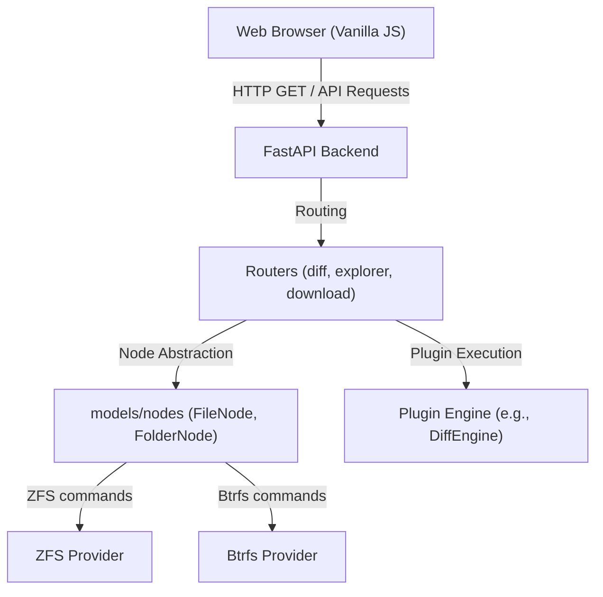

# System Architecture Overview

Universal Snapshot Explorer is a high-performance, lightweight, read-only web explorer and audit tool designed for **OpenZFS, Btrfs & POSIX filesystem snapshots**. 

The system is built on a strictly typed **FastAPI (Python)** backend and a **Vanilla JS** frontend. It avoids heavy build steps for the frontend and focuses on fast, direct filesystem reads and metadata parsing.

## Architectural Principles

1. **Strict Typing**: The backend enforces strict type hints validated by `basedpyright`. No implicit `Any` is allowed.
2. **Security by Design**: Security checks (e.g., path traversal prevention, access controls) are centralized at policy enforcement points (PEP), avoiding scattered "shotgun security" checks.
3. **No Frontend Build Chain**: The frontend relies purely on Vanilla JavaScript, utilizing ES modules and modern browser APIs. It is free of Node/npm dependencies for runtime logic.
4. **Pluggability**: Core capabilities such as diffing are designed as plugins, allowing easy extension for new file formats or visualization techniques.

## Core Modules

Detailed architectural decisions and data flows are documented in the following modules:

- **[Backend Architecture](architecture/backend.md)**: FastAPI routing, filesystem abstractions (ZFS/Btrfs), data flow, and dependency injection.
- **[Frontend Architecture](architecture/frontend.md)**: Vanilla JS structure, state management, and DOM interaction.
- **[Plugin Architecture](architecture/plugins.md)**: Plugin system design, including the N-way differ protocol and dynamic frontend integration.

## Dependency Graph

